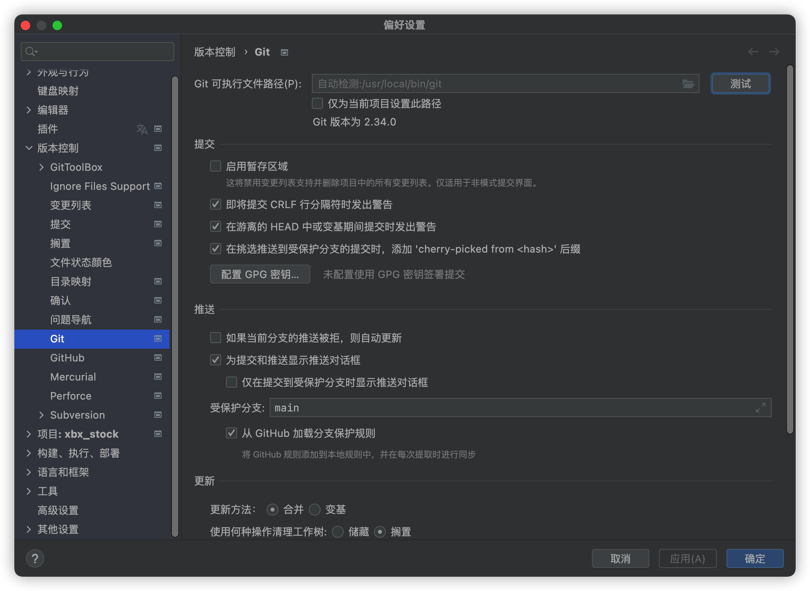

# ⛵ macOS git 更新

## 安装 Homebrew

```bash
/usr/bin/ruby -e "$(curl -fsSL https://raw.githubusercontent.com/Homebrew/install/master/install)"
```

## 升级git

```bash
❯ brew install git

Warning: Bottle missing, falling back to the default domain...
==> Downloading https://ghcr.io/v2/homebrew/core/git/manifests/2.34.0
######################################################################## 100.0%
==> Downloading https://ghcr.io/v2/homebrew/core/git/blobs/sha256:13af03a780b7a2
==> Downloading from https://pkg-containers.githubusercontent.com/ghcr1/blobs/sh
######################################################################## 100.0%
==> Installing dependencies for git: gettext and pcre2
==> Installing git dependency: gettext
==> Pouring gettext-0.21.monterey.bottle.tar.gz
🍺  /usr/local/Cellar/gettext/0.21: 1,953 files, 20.2MB
==> Installing git dependency: pcre2
```

## 改变git默认指向

```shell
❯ which git
/usr/local/bin/git
❯ git --version
git version 2.15.0
(重点)❯ brew link git --overwrite
Linking /usr/local/Cellar/git/2.34.0... 213 symlinks created.
```

## 验证

```shell
❯ which git
/usr/local/bin/git
❯ git --version
git version 2.34.0
```



## 参考文献

* [macOS 升级 Git 版本 - 简书 (jianshu.com)](https://www.jianshu.com/p/6eca0eadcc22)
