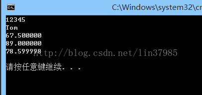
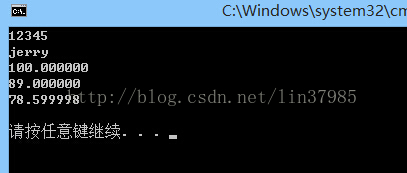

# 📳 结构体做参数传递

## 理论

**首先结构体做函数参数有三种传递方式:**

一是传递结构体变量，这是值传递，二是传递结构体指针，这是地址传递，三是传递结构体成员，当然这也分为值传递和地址传递。

以传引用调用方式传递结构比用传值方式传递结构效率高。以传值方式传递结构需要对整个结构做一份拷贝。

## 例子

#### 1.下面传递结构体变量

```cpp
#include<stdio.h>
#include<string.h>
#define format "%d\n%s\n%f\n%f\n%f\n"
struct student
{
    int num;
    char name[20];
    float score[3];
};
void change( struct student stu );
int main()
{
    
    struct student stu;
    stu.num = 12345;
    strcpy(stu.name, "Tom");
    stu.score[0] = 67.5;
    stu.score[1] = 89;
    stu.score[2] = 78.6;
    change(stu);
    printf(format, stu.num, stu.name, stu.score[0], stu.score[1],stu.score[2]);
    printf("\n");
    return 0;
}
 
void change(struct student stu)
{
    stu.score[0] = 100;
    strcpy(stu.name, "jerry");
}
```



可以看到最终输出的score值并未改变

#### 2.地址传递

```cpp
#include<stdio.h>
#define format "%d\n%s\n%f\n%f\n%f\n"
struct student
{
    int num;
    char name[20];
    float score[3];
};
void change( struct student* stu );
int main()
{
    
    struct student stu;
    stu.num = 12345;
    strcpy(stu.name, "Tom");
    stu.score[0] = 67.5;
    stu.score[1] = 89;
    stu.score[2] = 78.6;
    change(&stu);
    printf(format, stu.num, stu.name, stu.score[0], stu.score[1],stu.score[2]);
    printf("\n");
    return 0;
}
 
void change(struct student* p)
{
    p->score[0] = 100;
    strcpy(p->name, "jerry");
}
```



可以看到，通过地址传递修改了结构体内的数据

用\&stu做实参,\&stu是结构体变量stu的地址。在调用函数时将该地址传送给形参p(p是指针变量)。这样p就指向stu。

在change函数中改变结构体内成员的值，在主函数中就输出了改变后的值

#### 3.结构体成员的地址传递和值传递

这个类似于单一变量的传递，这里也没必要说了，当然是地址传递才能修改。

把一个完整的结构体变量作为参数传递,要将全部成员值一个一个传递,费时间又费空间,开销大。如果结构体类型中的成员很多，或有一些成员是数组，则程序运行效率会大大降低。在这种情况下，用指针做函数参数比较好，能提高运行效率。
