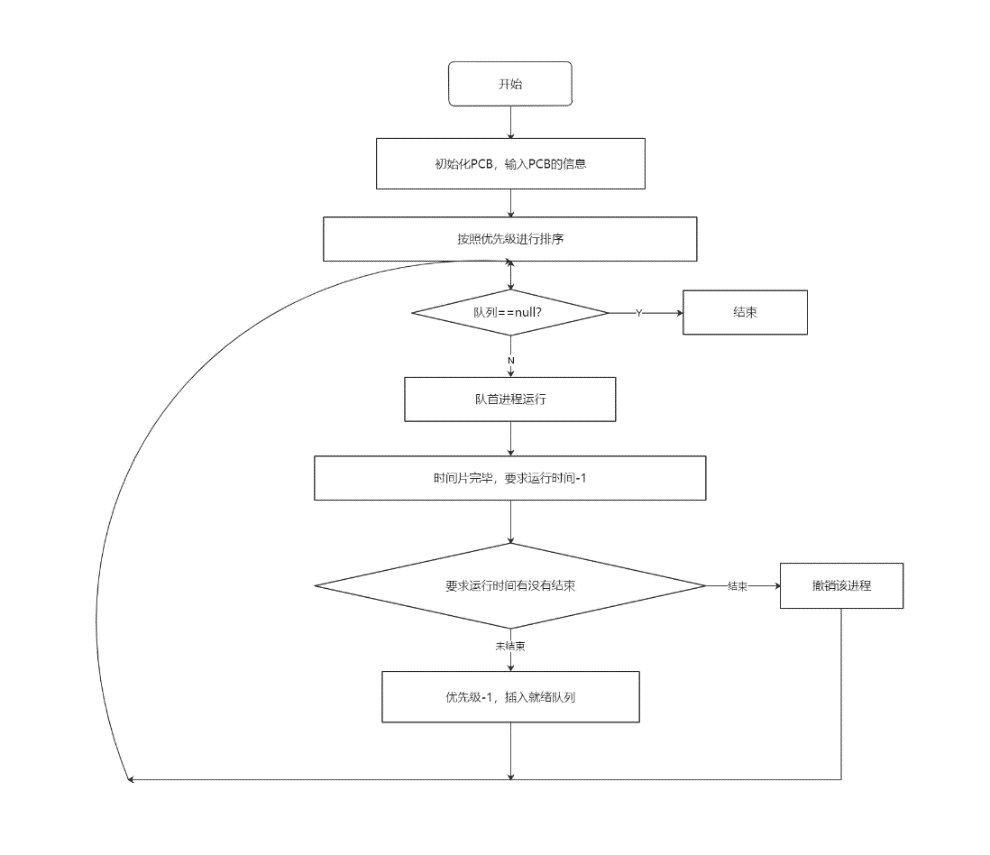

# ⭕ 优先级数轮转法

### 流程图



### 代码

```java
package work;
/*
 *项目名: 实验1
 *文件名: PCB
 *创建者: ZhangChengkai
 *创建时间:2020/4/29 8:18
 */

public class PCB {
    private String name;//进程名,假设五个进程的进程名分别是P1，P2，P3，P4，P5
    private Integer rtime;//是文档里的时间，其实是运行时间
    private Integer ntime;//要求运行时间----假设进程需要运行的单位时间数
    private Integer priority;//赋予进程的优先数，调度时总是选取优先数大的进程先执行
    /*
    “就绪”状态和“结束“状态，五个进程的初始状态都为“就绪“状态，用“R”表示，当一个进程运行结束后，它的状态变为“结束”，
    用“E”表示。
    */
    private String state;

    //构造函数与setter,getter
    public String getName() {
        return name;
    }

    public void setName(String name) {
        this.name = name;
    }

    public Integer getRtime() {
        return rtime;
    }

    public void setRtime(Integer rtime) {
        this.rtime = rtime;
    }

    public Integer getNtime() {
        return ntime;
    }

    public void setNtime(Integer ntime) {
        this.ntime = ntime;
    }

    public Integer getPriority() {
        return priority;
    }

    public void setPriority(Integer priority) {
        this.priority = priority;
    }

    public String getState() {
        return state;
    }


    public void setState(String state) {
        this.state = state;
    }

    public PCB(String name, Integer rtime, Integer ntime, Integer priority, String state) {
        this.name = name;
        this.rtime = rtime;
        this.ntime = ntime;
        this.priority = priority;
        this.state = state;
    }

    public PCB() {
    }
}
```

```java
package work;
/*
 *项目名: 实验1
 *文件名: Main
 *创建者: ZhangChengkai
 *创建时间:2020/4/29 8:34
 */

import java.util.ArrayList;
import java.util.Collections;
import java.util.List;
import java.util.Scanner;

public class Main {
    static List<PCB> listOfProcess = new ArrayList();

    public static void main(String[] args) {
        System.out.println("**************");
        System.out.println("**************");
        System.out.println("程序运行开始,输入进程数：");
        Scanner scanner = new Scanner(System.in);
        int num = scanner.nextInt();
        PCBcontrol(num);
        System.out.println("当前就绪进程队列状态为：");
        for (int i = 0; i < listOfProcess.size(); i++) {
            display(listOfProcess.get(i));
        }
        System.out.println();
        //初始时间
        int h = 0;
        while (listOfProcess.size() != 0) {
            h++;
            System.out.println();
            System.out.println("当前时间是:" + h);
            System.out.println();
            listOfProcess.get(0).setState("R");
            checkPCB(listOfProcess.get(0));
            running(listOfProcess.get(0));
            System.out.println("输入任意数字，并按回车键继续：");
            scanner.nextInt();
        }
        System.out.println("进程已经完成");
    }

    //进程查看函数
    private static void checkPCB(PCB pcb) {
        //显示正在运行的进程
        System.out.println("当前正在运行的进程是:" + pcb.getName());
        display(pcb);

        //显示就绪进程
        System.out.println("当前就绪队列状态为:");
        for (int i = 1; i < listOfProcess.size(); i++) {
            display(listOfProcess.get(i));
        }
        System.out.println();
    }


    //进程运行处理的函数
    private static void running(PCB pcb) {
        pcb.setRtime(pcb.getRtime() + 1);//运行时间到，占用CPU的时间+1
        if (pcb.getRtime() == pcb.getNtime()) {//如果已经完成
            destory();
            System.out.println(pcb.getName() + "已经运行完成");
        } else {
            pcb.setPriority(pcb.getPriority() - 1);//优先数-1
            pcb.setState("E");//ending
            sort(listOfProcess, 0, listOfProcess.size() - 1);
            Collections.reverse(listOfProcess);
            showProcess();
        }
    }

    //撤销进程的函数
    private static void destory() {
        listOfProcess.remove(0);//移除首进程
    }

    //查看就绪队列进程
    private static void showProcess() {
        System.out.println("运行完一个时间片之后，就绪队列为：");
        for (int i = 0; i < listOfProcess.size(); i++) {
            display(listOfProcess.get(i));
        }
        System.out.println();
    }

    //显示当前进程
    private static void display(PCB pcb) {
        System.out.println("进程名\t状态\t优先级\t运行时间\t需要时间");
        System.out.println(pcb.getName() + "\t\t" + pcb.getState() + "\t\t" + pcb.getPriority() + "\t\t" + pcb.getRtime() + "\t\t" + pcb.getNtime());
    }

    //优先级排序函数
    private static void sort(List<PCB> listOfProcess, int low, int high) {
        int begin = low;//begin为从前往后的游动下标,从low开始
        int end = high;//end为从后往前的游动下标，直到high
        int pri = listOfProcess.get(low).getPriority();//拿到low的优先级，为了作比较
        while (end > begin) {
            //从后往前使end后的值都比end小
            while (end > begin && listOfProcess.get(end).getPriority() >= pri) {
                end--;
            }
            //begin与end值交换
            if (listOfProcess.get(end).getPriority() <= pri) {
                PCB temp = listOfProcess.get(end);
                listOfProcess.set(end, listOfProcess.get(begin));
                listOfProcess.set(begin, temp);
            }
            //从前往后使begin前的都比begin小
            while (end > begin && listOfProcess.get(begin).getPriority() <= pri) {
                begin++;
            }
            if (listOfProcess.get(begin).getPriority() >= pri) {
                PCB temp = listOfProcess.get(end);
                listOfProcess.set(end, listOfProcess.get(begin));
                listOfProcess.set(begin, temp);
            }
        }
        //向下递归排序
        if (low < begin) {
            sort(listOfProcess, low, begin - 1);
        }
        if (high > end) {
            sort(listOfProcess, end + 1, high);
        }
    }

    //输入PCB的有关数据
    private static void PCBcontrol(int num) {
        Scanner scanner = new Scanner(System.in);
        for (int i = 0; i < num; i++) {
            System.out.println("输入进程名：");
            String name = scanner.next();
            System.out.println("输入进程优先级");
            int priority = scanner.nextInt();     //忘记了nextInt()接受int类型
            System.out.println("输入进程运行时间");
            int ntime = scanner.nextInt();
            System.out.println("****************");
            //构造函数初始化
            PCB pcb = new PCB(name, 0, ntime, priority, "E");
            listOfProcess.add(pcb);

            //建立对进程进行优先级排列函数
            sort(listOfProcess, 0, (listOfProcess.size() - 1));
            Collections.reverse(listOfProcess);
        }
    }
}
```
