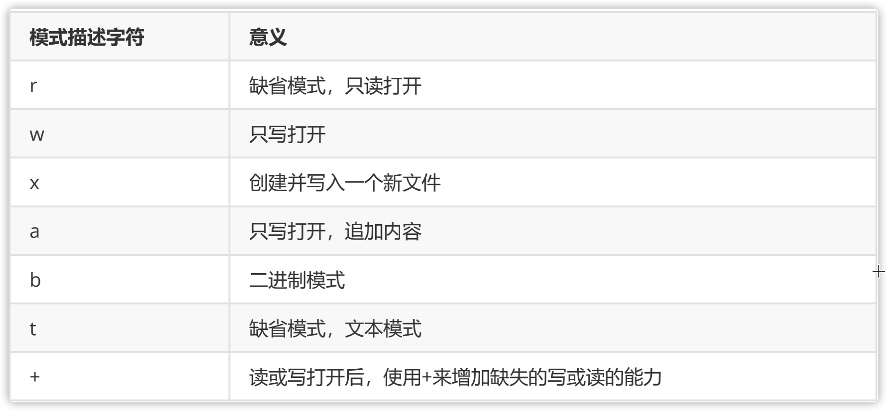

# 🚪 with open方法

## 简介

Python内置了读写文件的函数，用法和C是兼容的。

由于文件读写时都有可能产生`IOError`，一旦出错，后面的`f.close()`就不会调用。所以，为了保证无论是否出错都能正确地关闭文件，我们可以使用`try ... finally`来实现：

```python
try:
    f = open('/path/to/file', 'r')
    print(f.read())
finally:
    if f:
        f.close()
```

但是每次都这么写实在太繁琐，所以，Python引入了`with`语句来自动帮我们调用`close()`方法。

这和前面的`try ... finally`是一样的，但是代码更佳简洁，并且不必调用`f.close()`方法。

## 应用

```python
with open(r'filename.txt') as f:
   data_user=pd.read_csv(f)  #文件的读操作

with open('data.txt', 'w') as f:
   f.write('hello world')  #文件的写操作
```




```
r:	以只读方式打开文件。文件的指针将会放在文件的开头。这是**默认模式**。
rb: 以二进制格式打开一个文件用于只读。文件指针将会放在文件的开头。这是默认模式。
r+: 打开一个文件用于读写。文件指针将会放在文件的开头。
rb+:以二进制格式打开一个文件用于读写。文件指针将会放在文件的开头。
w:	打开一个文件只用于写入。如果该文件已存在则将其覆盖。如果该文件不存在，创建新文件。
wb:	以二进制格式打开一个文件只用于写入。如果该文件已存在则将其覆盖。如果该文件不存在，创建新文件。
w+:	打开一个文件用于读写。如果该文件已存在则将其覆盖。如果该文件不存在，创建新文件。
wb+:以二进制格式打开一个文件用于读写。如果该文件已存在则将其覆盖。如果该文件不存在，创建新文件。
a:	打开一个文件用于追加。如果该文件已存在，文件指针将会放在文件的结尾。也就是说，新的内容将会被写入到已有内容之后。如果该文件不存在，创建新文件进行写入。
ab:	以二进制格式打开一个文件用于追加。如果该文件已存在，文件指针将会放在文件的结尾。也就是说，新的内容将会被写入到已有内容之后。如果该文件不存在，创建新文件进行写入。
a+:	打开一个文件用于读写。如果该文件已存在，文件指针将会放在文件的结尾。文件打开时会是追加模式。如果该文件不存在，创建新文件用于读写。
ab+:以二进制格式打开一个文件用于追加。如果该文件已存在，文件指针将会放在文件的结尾。如果该文件不存在，创建新文件用于读写。
```



file.read(\[size]) 将文件数据作为字符串返回，可选参数size控制读取的字节数 file.readlines(\[size]) 返回文件中行内容的列表，size参数可选 file.write(str) 将字符串写入文件 file.writelines(strings) 将字符串序列写入文件 file.close() 关闭文件 file.closed 表示文件已经被关闭，否则为False

file.mode Access文件打开时使用的访问模式 file.encoding 文件所使用的编码 file.name 文件名 file.newlines 未读取到行分隔符时为None，只有一种行分隔符时为一个字符串，当文件有多种类型的行结束符时，则为一个包含所有当前所遇到的行结束的列表 file.softspace 为0表示在输出一数据后，要加上一个空格符，1表示不加。这个属性一般程序员用不着，由程序内部使用


## 参考文献

* [https://blog.csdn.net/weixin\_44041700/article/details/108173614](https://blog.csdn.net/weixin\_44041700/article/details/108173614)
* [https://www.cnblogs.com/soymilk2019/p/14442806.html?ivk\_sa=1024320u](https://www.cnblogs.com/soymilk2019/p/14442806.html?ivk\_sa=1024320u)
* [https://www.cnblogs.com/ymjyqsx/p/6554817.html](https://www.cnblogs.com/ymjyqsx/p/6554817.html)
* [https://blog.csdn.net/MsSpark/article/details/86745391](https://blog.csdn.net/MsSpark/article/details/86745391)
