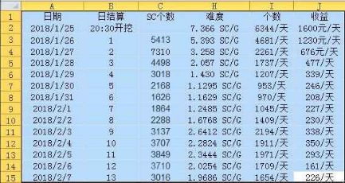
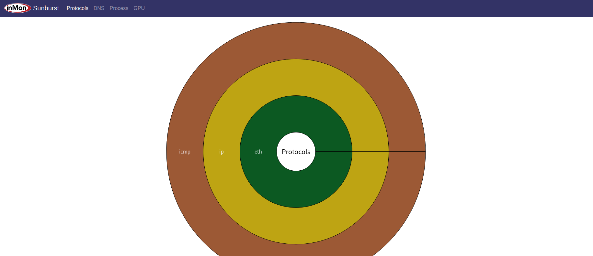

# 😛 数字货币挖矿基础知识

**数字货币挖矿基础知识**

>)

### 挖矿的背景

13-14年展现规模，17年牛市快速发展，中国产业完整度高，算力贡献高：电力充足，巨头林立，芯片代工厂大，矿池巨大

矿工偏下游产业，矿机商老大

挖矿的入行节点：最佳为牛市之首，在减半之时入场较好，因为旧矿机因为算力问题会被淘汰

### 矿机种类

ASIC芯片矿机

#### BTC等等

#### 优点：效率高

#### 缺点：挖的币种少

### 显卡矿机

#### ETH等等

#### 优点：币种多

#### 缺点：币种的算力，币价不稳定

### 矿机的选择

### 品牌

#### 蚂蚁

#### 神马

#### 芯动

#### 阿瓦隆

### 尽量算新上市的机器，算的是当前的回本周期，收到全网算力和币价的影响

### 蚂蚁SC矿机失败案例：小币种，不保证，因此首选比特币

### 挖矿收益计算

### 计算器：https://btc.com/tools/mining-calculator

#### 图片

>)

### 五大要素

#### 电费

#### 矿机算力

#### 矿机维护成本

#### 全网算力

* 难度和币量成反比，红框是18年BTC横盘，币量很多是好节点

>)

* 重点，币价从来没有击穿过挖矿成本，只是利润问题\

#### 币价 

### 矿机价格

定价模型：发售时的矿机回本周期

现货>期货，并且现货优先

### 矿机后台设置

https://blog.f2pool.com/zh/help/mining-tutorial

托管直接不管

矿池选择

鱼池

蚁池

大矿池。

电力资源

水电：丰水期好，但是枯水期有问题

火电：电力稳定，较好

新能源不考虑

### 温度

北方较冷，条件好

制冷对于矿机十分关键

芯片矿机勿在家中挖矿

### 问题 

挖矿的最高收益已经离去，资金量小建议定投

政策性风险影响巨大

比特币破新高很可能，因为利益方驱动，如矿机商的关系
