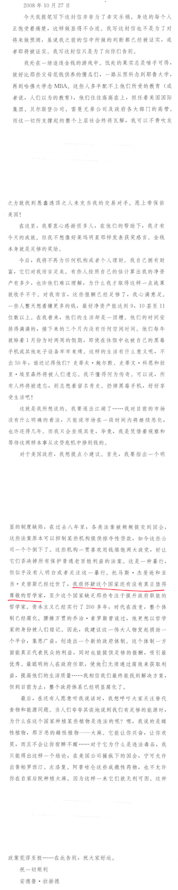

# 🏹 《史上最伟大的交易》笔记

## 前言&序章

* 40岁风流，44岁说戒就戒，强大的自控力，管住自己的欲望和重要
* 大的经济浪潮是我们不可改变的，难能可贵的是不随大流，真的客观的从数据，从实际情况去分析，并去实践
* 保守派是一种投资的习惯，找到并坚信自己投资的方式很重要

## 第二章 资金泛滥吹起的房产泡沫

### 第一节 房产泡沫兴起

> 就像著名侦探小说《东方快车谋杀案》的现代版一样，这场现代经济崩盘之痛是由长期以来各种负面因素累积而成的，各种各样的狡诈、勾结、幼稚、愚蠢以及贪婪守旧共同导致了这场灾难。

在文字介绍下，我逐渐对于那个时代有了更加深入的了解，通胀的时代，金融改革的进行、媒体的炒作、房地产的兴旺，这就像是燃料一般，使得经济这班火车疯狂的加速，就在这种背景之下，才有保尔森的行动。

### 第二节 疯狂膨胀的信贷市场

通过资产证券化，美国人将负债包装为产品并且重新销售，因为销往全球的养老基金和银行等金融机构，导致链式反应。而由情绪主导的不加限制的贷款，更是火上添油的表现，通过将名字换成自述贷款、忍者贷款等，他们美化了抵押名称。

### 第三节 按揭贷款乱象

* 评级公司也是一大推手，通过在合约中隐藏免责条款，撇清责任而且推波助澜。
* 大家总有这样根深带固的想法:将全国成千上万的贷款分装成一份份小额投资项目，相当于分散风险，由全球千千万万的投资者来共担风险。而新冠告诉我们：这不可行。。

### 第四节 难寻做空房市之路

* 莫做出头鸟，房市大好的情况下，交易员逆势而行，不仅会失去可观的利润，还有可能从此断送自己的职业生涯，因此做空房市难也是有原因的。
* 2005年冬天，一些银行家聚在一起，共进了一顿赫赫有名的午餐后，想要再做空房市或者次级贷款债券资产池已无多少可能。但即便如此，历史的大势还是不可违抗的，就像红头文件改变不了经济规律一般。

## 第三章 做空房市的绝密武器

* 保尔森的动力也有 很大一部分的认同感的需求，如下文：“为了公司的生存，我得成为业界大佬，如果公司做得一般，就 很容易被淘汰，”他回忆道，“我想成为这个行业中举足轻重的 一员。”
* 保尔森能够成为质疑房价并且最终成功的原因可能有如下两点：1. 用信念投资，这才能坚持做空 2. 有投行经验，能够看准人，做好事
* 佩莱格里尼计算机出身，但是有钻研精神并且坚持不放弃，他是一个很特别的人：“我已经45岁了，毫无价值，我觉得自己没有一点希望。”

## 第四章 悲剧英雄迈克尔-伯利

### 伯利的前半生

伯利的人生并不是一帆风顺，他从小瞎了一只眼，并且倔强，坚守他的原则。他医生出生，半路出家加入金融行业，但是他灵敏的洞察力让他明白房市的危机，他看到了CDS的潜力，并且疯狂购买CDS，如下文“觉得自己就像个来到半价糖果店的小孩子，拼命地抢购，一心想赶在别的小孩发现之前，把尽可能多的糖果收归已有。伯利暗忖:难道其他投资者都没发现这个商机?”

当然，他的经商生涯也是出师不利："一些按揭贷款的保险费很快开始上升，令伯利急得不行，眼看 这笔大交易就要溜走了。他在办公室里把Megadeth和Disturbed乐 队的重金属音乐开得很大声，贝斯的声音震得整个地板嗡嗡作响。 最常播放的乐曲还有Metallica乐队的《赶尽杀绝》和Pantera的 《地狱牛仔》。"他缺少排解紧张的方式。

### 李普曼：CDS之父

他的个人特征十分明显，比如："喜欢欧式风格套装，衬衫常常穿得随意松散"，"他知道全市最好吃的寿司店是哪家"，"他似乎并不在意同事对他的议论，他说话喜欢夸张，有时故意表演得活灵活现"。他是一个乐观而且特立独行者，他制作CDS的目的是为了给做空方一种方式，也符合了多方筹集资金的目的。

CDS简述如下：这是双方之间签订的一种合同，而非贷象。这种合同是为承保那些激进型按揭贷 款而签订的，和按揭贷款没什么两样。如果贷款的安全系数高，这些合同就升值;如果借款人没法及时还贷，这些合同就贬值。CDS合同的买方每为100万美元的高风险债券投保，就必须按年付保险费给卖方。如果债券变得不值钱，卖方将付给买方10万美元。也就是说如果CDS下的债券现金流有问题，CDS的卖方必须按合同金额付现金给买方，这叫做“现金支付”。

## 第五章 佩莱格里尼的神秘图表

### 保尔森试水CDS

在有了对房价的判断后，保尔森立马就行动了，他对整个国家的经济状况和房地产市场的担忧却与日俱增。他认为昏头昏脑的投资者不断购入各种BRB级按揭贷款债券及其他垃圾债券，却从不考虑投资回报。这些债券的利率仅比最安全的美国国库券利率高一个百分点，可见疯狂的气氛充斥着市场。

CDS合同与做空股票债券不同，其最大的损失无非只是缴纳年保险费而已，而保尔森找到了方向。

### 佩莱格里尼的担忧

佩莱格林尼承担了巨大的压力，但是他充满了斗志，而他大概已经40多岁了，他的热情和勇气让我感到震撼，而他也在了解情况中不断改变着自己的判断。

### 李普曼由多转空

终于看到一位中国朋友了，李普曼是一位有能力的人，他发现了房价和违约率的关系了，他就像是在破译密码，并最终发现结果是《百年孤独》中的毁灭世界的龙卷风一般。

### 黎明前的黑暗

佩莱格里尼考虑了很多因素，他发现只有当美国的房地产撑不下去开始下跌，借款人无法再融资还贷时，才有可能真正做空交易，而这一切似乎还很遥远。

而他在研究后给房产数据引入了“趋势线”，这样一来，房价最近上涨多少就一目了然。他把全国每年房价的变化整理出来并还原分析了那个时间段的数据变化，理顺了价格的起起落落。突然之间.答案清清楚楚地显示在他面前:1975—2000年间，如果把通货膨胀因素考虑进去，房价每年仅上升1.4%但在2000佩莱格里尼的神秘图表29年之后的5年内，房价以每年7%的速度激增。因此可以得出结论:美国房价将下跌40%以上，直到回落至它的历史趋势线。且不说过去房价不会像目前这样猛涨，佩莱格里尼的数字还显示，过去每次房价下跌时，都是直接跌破趋势线，这说明房价的下跌很可能非常迅猛。

看到这里我确实感觉到那种兴奋感，是强烈的。

## 第六章 保尔森策划直击要害

### 成王败寇论股市&房市的隐忧

本节是为了烘托做空之难而书写的，文中列举了本杰明•格雷厄姆、杰西•利弗莫尔、迈克尔•斯坦哈特等等人的失败，他们明白看出泡沫对于一位投资者不算什么，有些泡沫 看似到了历史顶点，但还会继续涨下去，涨到你无法想象。但是总有一些人能够找到机遇并且把握。

而文章中 描述也让我感到共情，作为一个学生，我也对房子的价格感到恐惧。

### 保尔森全力押注CDS & 艰难的新基金推销

运气确实重要，在2006年春天房价已经开始持平，这是个做空市场的大好时机。此时，其他过早发力的做空交易者可能正在一旁舔着自己的伤口，因为他们过早下注.而房价继续上涨，所以损失不少。

而让这个观念影响到别人也十分困难，专家的不认同，客户的怀疑，充分竞争的行业，确实是机会伴随着风险。

## 第七章 背叛兄弟的大空头格林

格林的发家历史是传奇的，从草根出身，通过电话推销起家，并且在房市上大赚特赚，在危难之中努力寻找方向，并且顺利坐上房价上升的火车，在家财万贯后还保持着警惕，对于机会也勇敢把握，他确实是位传奇般的人物，🍋酸了。

## 第八章 等不到希望的痛苦坚持

在太阳出现之前，只有黑夜，比尔森、格林、李普曼等空头们只有坚守着，等到太阳出现。

保尔森不断买入ABX指数，他继续押注，而佩莱格里尼则开始怀疑自己：“如果我们一味强调我们比高盛公司更了解市场,那无疑显得我们很愚蠢、很无理,毕竟高盛公司有那么多专业的团队和良好的声誉。”

伯利则强硬的将资金冻结，和客户决裂，这最终导致了他的投资破裂。

李普曼强硬的说服管理员购买CDS，并且不断等待，而他确更加坚信自己的判断。

## 第九章 寻找更大的猎物

### CDO

投资商买下一系列有价证券，标的均为有现金流量的资产。如同其他资产证券化一样，这些资产都有着不同等级的风险。最高风险的CDO给投资者带来最高的回报。但如果CDO得到的现金支付比预期少的话，这些最高风险的债券最先亏损。有些债券承诺年回报率近10%，而评级机构常能给AAA级别，CDO的发行为房市打了一剂强心针，而房市已经病入膏肓，那么等待他的只有死的更惨。

### 保尔森做大有毒泡沫

银行家猜测到了，保尔森会将各种濒临危险边缘的抵押债券和债务加入CDO，让CDO毁于一旦。购买这些CDO的除了有财大气粗的对冲基金，还有一些捐赠基金和养老基金，这些投资者在购买时还是会有所迟疑。保尔森全力押注了卖空，而贝尔斯登等企业则做了推手，只能说是一个愿打一个愿挨。

## 第十章 濒临绝境的草根拉赫德

1. 拉赫德是我的模样了，看准方向拿不到机会，遇到问题就摆烂，但是最终还是会继续努力
2. 专业背景和学识、外貌、谈吐都是一个人的重要资产
3. 美景和自然永远可以开导一个人
4. 要让客户相信，首先要在细节表现出真诚
5. 运动和幽默可以缓解焦虑

## 第十一章 市场顶部的危与机

1. 本章淋漓尽致的展现了在做空中赚钱的难，交易员骗卖合约、社会舆论压力、股东的不相信，要把钱拿在手中，确实十分困难
2. 顺境中确实心情好：保尔森总是笑容满面，员工们犯点小错，他也不再责难，而是变得耐心多了。2月的一天下午，股市收盘后保尔森来到霍尼的办公室，坐在他身边的一把椅子上，跷起二郎腿，忍不住得意地笑起来。他慢慢地将双手放在椅子扶手上，不说一句话，微笑变成开怀大笑。
3. 贝尔斯登等大银行在巨大的利益面前也是会心动的，总是做些“小动作”
4. 团队之间的关系需要协调，每个人都会关注自己的利益，就像佩莱格里尼真的是十分烦心，怕自己的奖金没了
5. 投资需要信任，伯利在年度审计的失败让他失去了赚钱的机会

## 第十二章 市场并不总是有效的

1. 格林的做法很聪明，他伪装为一位普通人去探明真实情况，并且发现排队要40分钟，打通后的建议也是很离谱，这是值得借鉴的思路
2. 普通人是最无辜的，他们往往承受了博弈的代价
3. 财富的积累往往需要抛弃道德观念，需要从普通人那里拿钱
4. 拉赫德的经历证明了时间是破局的最终方法，看命吧
5. 美联储主席本•伯南克发表演讲:“基本面因素最终将支持房产的需求,包括工资的稳定增长,以及低廉的抵押贷款利率。我们会密切关注次贷市场的发展。次贷市场的这点小问题不可能影响到整个宏观经济或者金融体系。”但是骨牌一旦被推倒，那么就不会停下。

## 第十三章 空头群英的杀戮时刻

1. 要找到博弈的对手，才能使得上劲，因此保尔森在发现对手是银行后才能正确决策
2. 要充满怀疑，并钻到事情里去弄明白，才能对于谎言了解透彻
3. 信用一旦崩溃，那么市场遭遇的就是毁灭性的打击
4. 三人行必有我师也需要勇气，更要放下身段
5. 在机构中一旦大有作为但还是任人摆布，从李普曼的经历看出如果可以还是要自己做生意啊
6. 保尔森终获成功，历史就是这般，但是他值得让我们学习

## 第十四章 毁灭之王的致命一击

1. 投资不能心软，保尔森直接给了贝尔斯登致命一击，他的老东家直接垮台
2. “对于这种做空者,扔到监狱都太便宜他了。应该扒光他的衣服,带到第五大街上游行示众,然后再绑到灯杆上,否则不足以表达我们对这个贪婪魔鬼的愤怒和绝望。”无产阶级全球都一样啊
3. 有的人终其一生都在别人的阴影之下，佩莱格里尼便是如此
4. 格林这类个人投资者反倒是因为没有偏见，而成功的赚到了大钱
5. 伯利的失败让他失去了成功的机会，我十分同情他，太多人都是行百里垮在了90里了

## 尾声

1. 今日，保尔森仍在投资，他遵循着自己的节奏，判断着市场的情况，他勇敢的做空房市，并且得到相应的回报。
2. 繁华终将逝去，每个人的成功只有一种方式，用自己的方法过完一生，拉赫德的投资不算太过成功，但是他找到了自己度过余生的方式。

\

