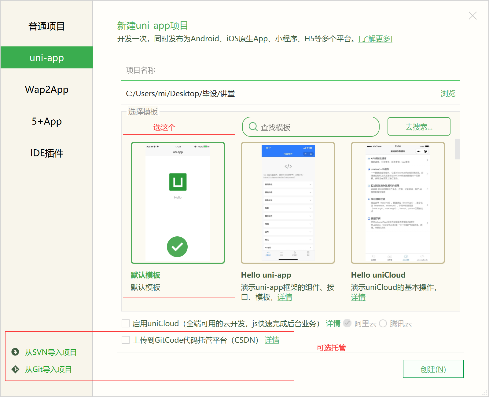
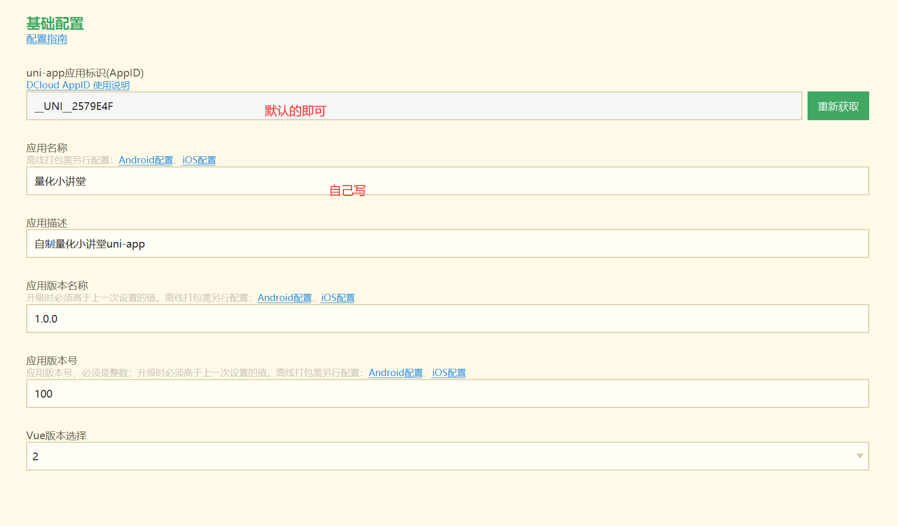
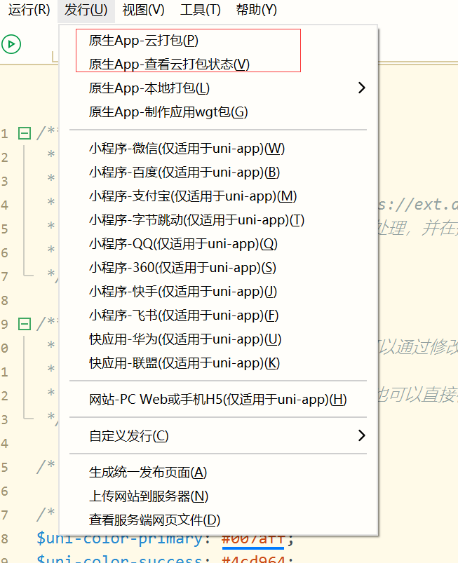

# Page 1

## 记一次uniapp封装网站经历

为了更方便的学习刑大的课程，我决定将网站封装为APP，并形成一个框架。而为了以后更方便的封装网站，我记录了这篇文章。

## 准备

1. 下载[HBuilderX-高效极客技巧 (dcloud.io)](https://www.dcloud.io/hbuilderx.html)
2. 新建->项目



## 开发

### 项目目录结构

.png>)

* 在index.vue写页面的样式，这就是封装页面的主体，调用的是webview去实现的。
* static文件夹下放的是图片等静态资源
* 在以下地方调配APP的设置


### index.vue 视图页面

因为也是才学习的内容，所以对于返回按钮的触动也不是很清楚，这里写了两种方式，可以都尝试一下

```html
<template>
	<view class="content">
		<web-view src="https://bbs.quantclass.cn/"></web-view>
		<!--在src填入想要封装的网站-->
	</view>
</template>

<script>
	export default {
		data() {
			return {
				title: 'quantclass'
			}
		},
		onLoad() {
			//返回效果实现1
			this.pushHistory() //调用pushHistory方法写入浏览器history当前状态，若不写不能监听到返回popstate方法
			window.addEventListener("popstate", function(e) { //监听手机或浏览器返回按钮 ps：安卓手机需要先点击一下页面此监听才能生效
				if (!window.history.state
					.id) { //t=通过state.id来判断是不是首页 若为首页id值为undefined，但是页面只是url地址发生改变，内容不会转变，所以我这里又重新加载了一遍页面
					window.location.reload()
				} else {
					window.location = 'https://bbs.quantclass.cn/';
				}
			}, false);
		},
		onReady() {
			//无边框观看，取消默认webview边框
			var that = this;
			uni.getSystemInfo({
				success: function(res) {
					var statusBarHeight = res.statusBarHeight;
					var screenHeight = res.screenHeight;
					var webviewHeight = screenHeight - statusBarHeight;
					that.$scope.$getAppWebview().children()[0].setStyle({
						top: statusBarHeight + 'px',
						height: webviewHeight + 'px'
					})
				}
			})
		},
		onBackPress(event) {
			//返回效果实现2
			var that = this;
			that.$scope.$getAppWebview().children()[0].canBack(function(e) {
				console.log(e);
				if (e.canBack == true) {
					that.$scope.$getAppWebview().children()[0].back();
					return true;
				} else {
					let main = plus.android.runtimeMainActivity();
					main.moveTaskToBack();
				}
			})
		},
		methods: {
            //返回效果实现1
			pushHistory() {
				var state = {
					title: "title",
					url: "#"
				};
				window.history.pushState(state, "title", "#"); //往history对象写入状态
			},
		}
	}
</script>

<style>

</style>
```

### App.vue设置

这里style需要调整一下

```html
<script>
	export default {
		onLaunch: function() {
			console.log('App Launch')
		},
		onShow: function() {
			console.log('App Show')
		},
		onHide: function() {
			console.log('App Hide')
		}
	}
</script>

<style>
	/*每个页面公共css */
	<style>
		    /*隐藏head标签*/	
		   uni-page-head{display: none;} 
		   /*body高度100%*/
		   uni-page-wrapper{height: 100% !important;}
	</style>
</style>
```

### manifest.json

APP的权限和设置！！！

#### 基础配置



#### 图标配置

.png>)

#### 启动界面

.png>)

#### 模块配置&权限配置

自行选用使用的内容

#### 常用其他设置

.png>)

#### 其他

其余使用时需要，自行配置

.png>)

#### page.json

改下这里的内容

.png>)

## 发行

1. 在[安卓证书在线制作-app在线生成-第八区 (dibaqu.com)](https://www.dibaqu.com/utils/android-cert)生成你的证书
2. 进行云打包



3\. 填写信息

.png>)

4\. 打包完成，下载即可

## 参考

[zcker/quantclass: A simple uniapp for quantcalss.cn (github.com)](https://github.com/zcker/quantclass)

这是我封装的网站，欢迎star✨
