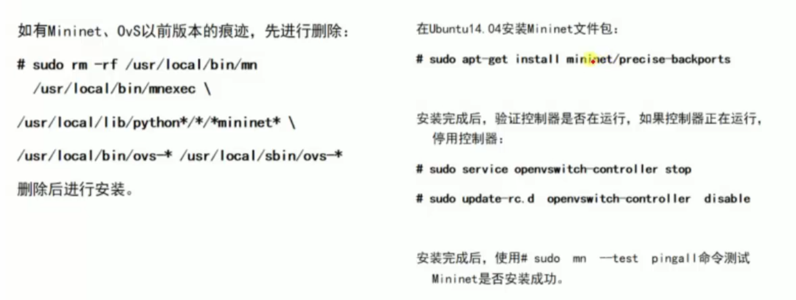
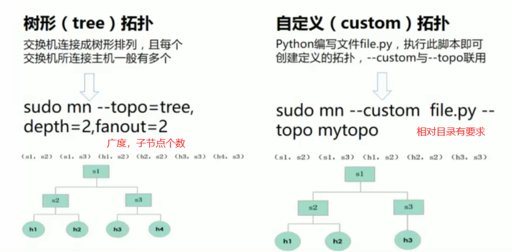
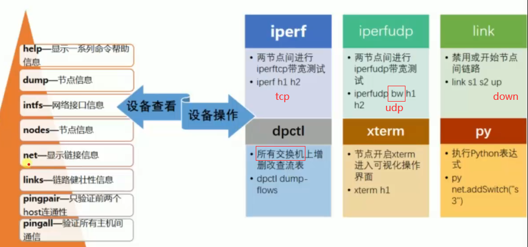
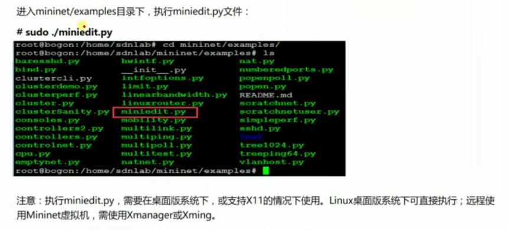
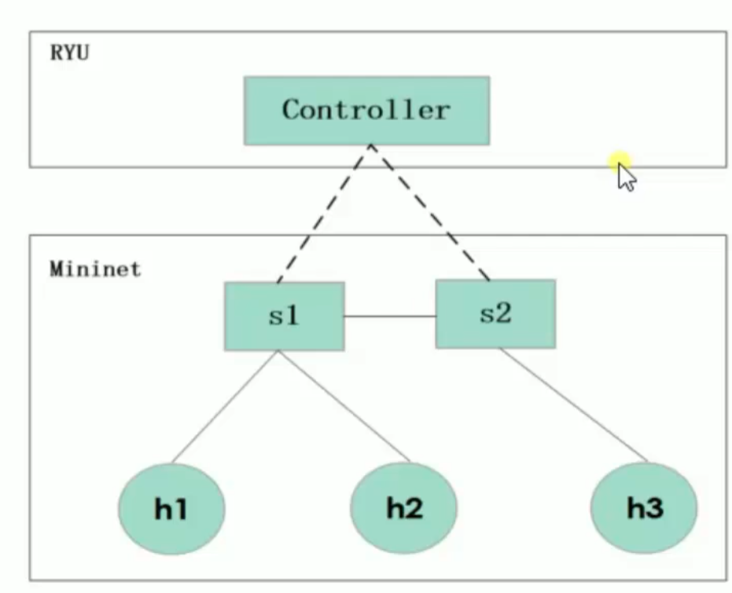
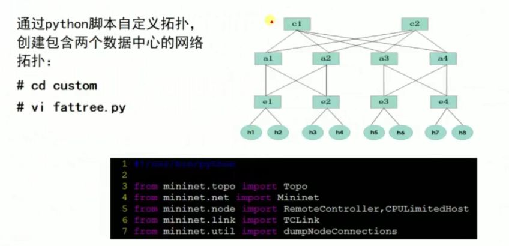
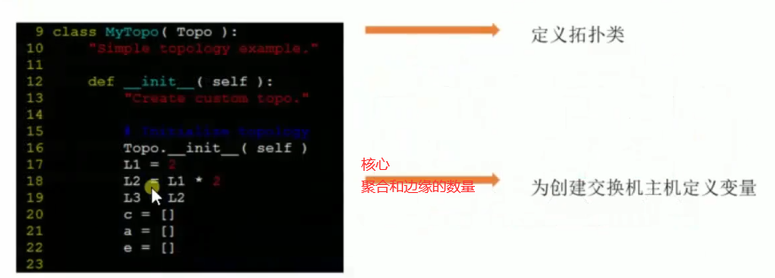
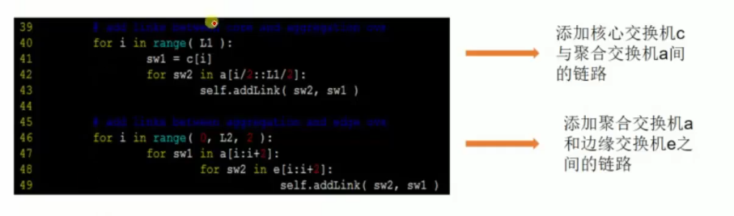

# 😁 Mininet入门与实战

### Mininet入门与实战

### 一、Mininet简介

>)

 (1)>)

### 二、Mininet安装部署

 (1)>)

 (1)>)

>)

>)

### 三、Mininet命令详解

### 网络构建启动参数

>)

>)

>)

>)

>)

### 内部交互命令

>)

使用py时添加节点后记得在交换机上添加对应的端口

switch.attach()

还有将主机设置IP

帮助文档

py dir('设备名') # 命令概览\
py help('设备名') # 详细命令

### 四、Mininet可视化

>)

`controller设置port和remote controller`

`switch的DPIP为16位,switch设置ovsk,NetFlow和sFlow设置开启查看信息`

`全体配置设置start CLI=True 和ovsk模式`

`保存后使用py 文件名的方式运行`

### 五、玩转流表

### 案例背景

>)

### 执行操作

 (1).png>)

.png>)

.png>)

 (1).png>)

.png>)

.png>)

.png>)

### 注意事项

如果手动添加流表，需要注意添加优先级，否则是默认在交换机中的先生效。

### 六、模拟多数据中心流量带宽 

### 案例背景 

>)

>)

>)

### 案例要求 

>)

>)

>)

>)

>)

>)

### 添加拓扑 

>)

>)

### 案例执行 

>)

一秒记录一次数据

## 参考资料

* 未来网络学院  [https://www.bilibili.com/video/BV1ft4y1a7ip](https://www.bilibili.com/video/BV1ft4y1a7ip)
