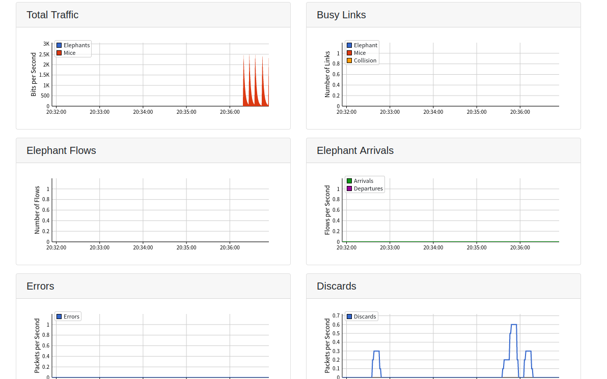

# 📞 sflow RT知识

### sflow-RT知识

### 原理

通过在网络设备，主机和应用中内嵌是flow的客户端来获取数据，并且通过REST API发送数据，通过应用去获取REST和HTTP的请求并展示

### 应用

### 主界面

 (1) (1)>)

### world-map

>)

### top-flows

>)

>)

### sunburst


### Metric Browser

>)

### dashboard-example

>)

### fabric-metrics





### mininet-dashboard

>)

>)

>)

### topology

>)

### Discard Browser

>)

## 如何写应用

* 应用通过sflow-RT的REST API 进行数据获取：[sFlow-RT Reference](https://sflow-rt.com/reference.php#rest)
* 目录格式：slowRT启动时会启动一个线程，并在scripts中的中找js文件，并以http://localhost:8008/app/my-app/html/格式返回

```
sflow-rt/app/my-app/html/index.html
sflow-rt/app/my-app/scripts/
```

* 打印信息，寻找错误，将消息的结构体打印出来：

```js
logInfo(JSON.stringify(request));
```

### 应用编写步骤

#### 定义流

流用于匹配共享公共属性和计算速率信息的数据包或事务

```python
下面的JavaScript函数定义了一个名为tcp的流，它捕获源和目标IP地址以及tcp端口，并计算每个流的每秒字节数
javascript:
setFlow('tcp',
 { keys:'ipsource,ipdestination,tcpsourceport,tcpdestinationport',
  value:'bytes', log:true } 
);
python:
#!/usr/bin/env python
import requests
import json

flow = {'keys':'ipsource,ipdestination,tcpsourceport,tcpdestinationport',
 'value':'bytes','log':True}
requests.put('http://localhost:8008/flow/tcp/json',data=json.dumps(flow))
```

#### 定义门限

定义流创建额外的度量和阈值，当与流关联的速率值超过阈值时，可以应用这些度量和阈值来生成通知。

```javascript
根据上面的流定义定义了一个阈值来检测超过1mbit/s 的 tcp 流
byFlow 标志表示应该为每个跨越阈值的每个流生成阈值事件。如果省略标志，将为最大的流生成单个事件。
setThreshold('large-tcp',
 { metric:'tcp', value: 1000000 / 8, byFlow:true }
);
```

```python
定义了一对阈值，用于根据终端利用率指标检测出入口/出口利用率超过70% 的交换机端口
js:
setThreshold('inutilization', { metric:'ifinutilization', value: 70 });
setThreshold('oututilization', { metric:'ifoututilization', value:70 });
py:
#!/usr/bin/env python
import requests
import json

threshold = {'metric':'tcp', 'value': 1000000/8, 'byFlow':True}
requests.put('http://localhost:8008/threshold/large-tcp/json',data=json.dumps(threshold))
```

#### 处理门限事件

注册一个事件处理函数，以通知每个新事件

```js
代码将事件转换为JSON并记录它们,这是一种在决定如何处理事件之前查看事件内容的有用方法。
setEventHandler(function(evt) {
 logInfo(JSON.stringify(evt));
});
```

REST API使用长轮询作为异步将事件推送到客户端的方法。HTTP请求阻止事件，直到出现新事件或超时。客户端在收到响应后立即重新连接，以等待进一步的事件。

```python
#!/usr/bin/env python
import requests
import json

eventurl = 'http://localhost:8008/events/json?maxEvents=10&timeout=60'
eventID = -1
while 1 == 1:
  r = requests.get(eventurl + "&eventID=" + str(eventID))
  if r.status_code != 200: break
  events = r.json()
  if len(events) == 0: continue

  eventID = events[0]["eventID"]
  events.reverse()
  for e in events:
    print json.dumps(e)
```

sFlow RT上安装的其他app可能已经定义了自己的事件。事件名称列表可以传递到setEventHandler（）调用中，也可以在REST调用中作为查询参数提供，以选择特定的事件流（基于阈值名称）。

#### 处理流记录

注册每个新流通知的流处理程序

```javascript
将流记录转换为JSON并记录它们。这是一种在决定如何处理流之前查看流内容的有用方法。
js:
setFlowHandler(function(flow) {
  logInfo(JSON.stringify(flow));
});
py:
#!/usr/bin/env python
import requests
import json

flowurl = 'http://localhost:8008/flows/json?maxFlows=10&timeout=60'
flowID = -1
while 1 == 1:
  r = requests.get(flowurl + "&flowID=" + str(flowID))
  if r.status_code != 200: break
  flows = r.json()
  if len(flows) == 0: continue

  flowID = flows[0]["flowID"]
  flows.reverse()
  for f in flows:
    print json.dumps(f)
```

定义影响记录的流记录的流时，可以应用许多设置。日志标志在定义流中进行了讨论，其他流日志记录选项包括：flowStart记录流的开始，activeTimeout定期导出长时间运行流的记录

#### 处理周期性事件

注册间隔处理程序以运行定期任务。


```javascript
代码每10秒运行一次，并使用JavaScript API函数metric（）、dump（）、table（）和activeFlows（）检索度量和流数据。
REST API客户端将有自己的轮询循环，或者可以使用cron计划定期运行。用于检索指标的REST API调用包括，/metric、/dump、/table和/activeflows。
js:
setIntervalHandler(function() {
 var r1 = metric('ALL','avg:load_one',{'host_name':['*.myco.com']});
 var r2 = dump('ALL','host_name;load_one',{'host_name':['*.myco.com']});
 var r3 = table('ALL,'host_name,sort:load_one:-10',{'host_name':['*.myco.com']});
 var r4 = activeFlows('ALL','tcp',10);
 // log results r1,r2,r3,r4
}, 10);
py:
#!/usr/bin/env python
import requests
import json

url='http://localhost:8008'
r1=requests.get(url+'/metric/ALL/avg:load_one/json?host_name=*.myco.com')
r2=requests.get(url+'/dump/ALL/host_name;load_one/json?host_name=*.myco.com')
r3=requests.get(url+'/table/ALL/host_name,sort:load_one:-10/json?host_name=*.myco.com')
r4=requests.get(url+'/activeflows/ALL/tcp/json?maxFlows=10')
# log results r1,r2,r3,r4
```

客户端通过其 IP 地址进行标识。每个 Agent 中的数据源定期导出一组值。数据源可以是网络接口、主机、虚拟机、应用程序实例等，而且在一个客户端中不同数据源之间的度量集是不同的。客户端 和 数据源 的组合引用了一组指标。

ALL标记扩展为所有代理的列表。代理可以以分号分隔的列表形式明确列出（分号用作无序列表的分隔符-代理的顺序对结果没有影响）。

metric查询遍历表并返回一个值，该值汇总了以逗号分隔的度量列表中的每个度量（逗号用于有序列表-结果以与查询中度量名称列表相同的顺序返回）。默认情况下，每个度量（以及报告度量的代理和数据源）的最大值将返回。可以通过在度量名称前面加上聚合类型和冒号来修改统计信息，在本例中，avg:指定需要平均值。过滤器可用于匹配每行中的度量值。在这些示例中，过滤器将查询限制为host\_name度量与模式\*匹配的行。麦可。通用域名格式。

表查询不汇总值。相反，查询从逻辑表返回包含查询中指定的指标的行。可以使用 sort: 前缀指示将用于对结果表进行排序的度量值(:-10后缀表示最多应返回10个值。负号表示反向排序，即返回最大的10个值)。转储查询与此类似，但是不是逐行遍历表，而是按照其内部顺序遍历单个指标。分号用于分隔转储查询中的度量名，以指示查询中度量名的顺序不影响结果中度量值的顺序。

将查询结果打印为JSON编码的字符串，或者使用REST API在浏览器中执行查询，这是一种很好的查询实验方法，可以查看响应中返回的详细信息。

#### 处理HTTP请求

注册HTTP处理程序以为应用程序构建自定义REST API

```javascript
将请求对象作为响应返回。在决定如何响应之前，这是一种查看请求对象中字段编码方式的有用方法。JSON编码的请求体支持GET、PUT、POST、DELETE和DELETE操作。
setHttpHandler(function(request) {
  return request;
});
路径如下：
http://localhost:8008/app/my-app/scripts/script.js/json
REST API可以使用OpenAPI规范进行文档化。添加一个api。包含应用程序主目录规范的yml文件：
sflow-rt/app/my-app/api.yml
```

#### 创建HTML用户界面

任何HTML5框架都可以使用。web用户界面通过对应用程序的HTTP处理程序进行AJAX调用来与应用程序交互，请参见处理HTTP请求。AJAX请求到应用程序脚本的相对路径：../scripts/script.js/json

外部应用程序可以使用CGI接口直接在web服务器下托管内容，并通过其REST API与sFlow RT交互。混合方法也是可能的，使用服务器端脚本构建一组特定于应用程序的功能，这些功能又通过远程web界面公开。

应用程序不需要用户界面。例如，如果应用程序向时间序列数据库或事件记录系统发送度量，则下游工具的用户界面可能是与数据交互的主要方法。

如果REST API是与应用程序交互的主要方法，那么Handle HTTP请求将描述如何记录API并添加交互式REST API资源管理器。

## 常用命令

```shell
重启
sudo systemctl restart sflow-rt

开始运行
./sflow-rt/start.sh

安装应用
./get-app.sh sflow-rt 应用名

mininet使用sflow-rt
sudo mn --custom extras/sflow.py --link tc,bw=10 --topo tree,depth=2,fanout=2
```

## 时延、吞吐量、丢包率

### 时延

延迟测量来自终端主机、负载平衡器和应用程序。

安装host sflow，通过在Linux的网络适配器的配置中，添加网络接口的数据监控，来进行RTT的数据获取。

### 吞吐量

sflow-RT中寻找，有值

### 丢包率

数据包丢失由接口计数器报告，例如ifindiscards、ifoutdiscards

## 安装host sflow监控

打开防火墙

```
sudo ufw allow 6343/udp
sudo ufw allow 8008/tcp
```
