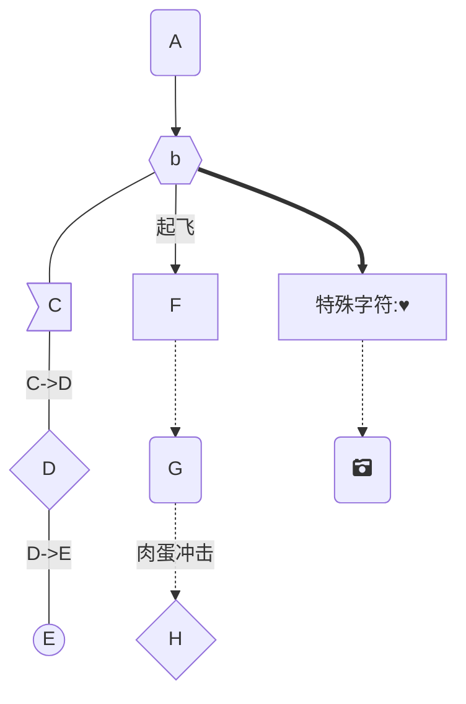
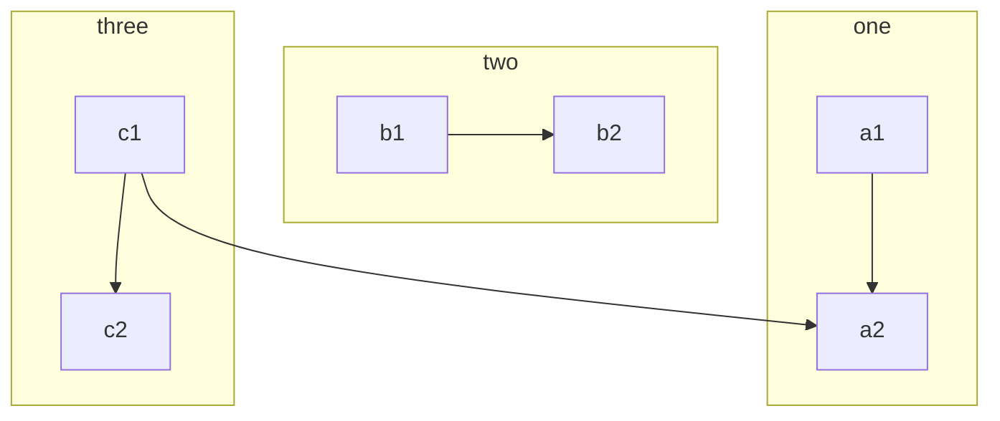
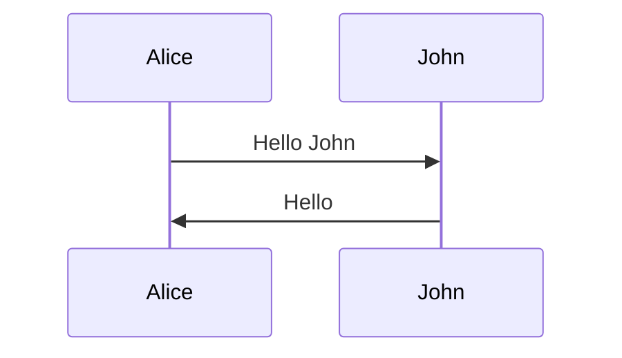
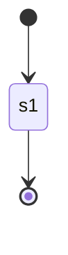

# 📈 typora画图

## 流程图

 (1) (1) (1) (1) (1).png>)

* TB - 从上到下
* BT - 从下到上
* RL - 从右到左
* LR - 从左到右
* TD - 与TB相同

## 子图

 (1) (1) (1) (1) (1).png>)

## 时序图

 (2) (1).png>)

## 状态图

 (1) (1) (1) (1).png>)

